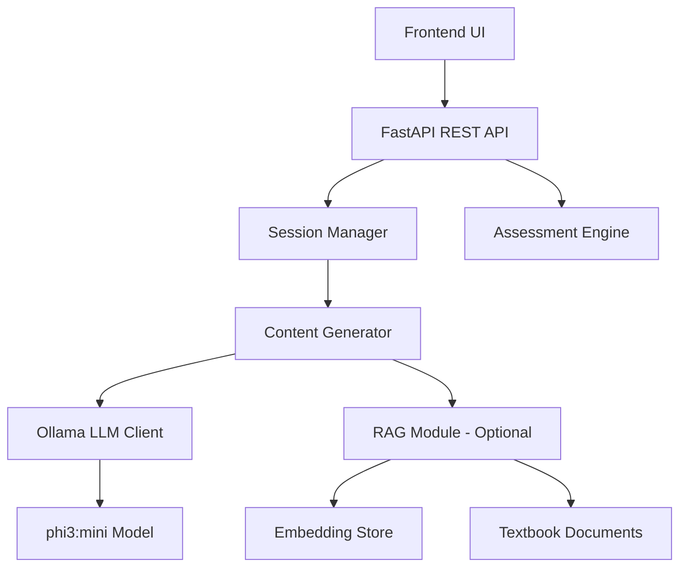

# Design Document: ADHD Adaptive Learning System

## Overview

The ADHD Adaptive Learning System is a Python-based FastAPI application that leverages local LLM inference (Ollama with phi3:mini) to deliver cognitively optimized micro-learning experiences. The system consists of three primary subsystems:

1. **Assessment Engine**: Determines student language comprehension level through a 5-question assessment
2. **Content Generation Engine**: Creates adaptive, ADHD-optimized learning steps using prompt engineering and structured output
3. **Session Management**: Handles interactive learning sessions with real-time command processing

The architecture prioritizes modularity, low latency (<2s), and cognitive accessibility through lexical simplification, concept chunking, and visual scaffolding.

## Architecture

### High-Level Architecture



### Component Responsibilities

**FastAPI REST API Layer**
- Exposes HTTP endpoints for assessment, session initiation, and command processing
- Validates input parameters (subject, topic, language level)
- Serializes responses to JSON
- Handles error responses and timeouts

**Assessment Engine**
- Stores predefined assessment questions with 4 complexity-graded options
- Tracks student responses
- Calculates median complexity level
- Persists language level assignments

**Session Manager**
- Maintains active session state (current step index, language level, subject, topic)
- Processes commands: "next", "simplify", "exit"
- Coordinates with Content Generator for step regeneration
- Manages session lifecycle

**Content Generator**
- Constructs prompts based on subject, topic, language level
- Applies ADHD-specific prompt engineering (chunking, simplification, scaffolding)
- Invokes Ollama LLM with structured output constraints
- Validates generated content (word count, structure)
- Optionally integrates RAG-retrieved context

**RAG Module (Optional)**
- Embeds textbook content into vector store
- Performs semantic search for relevant passages
- Provides context snippets to Content Generator
- Operates independently from core generation pipeline

## Components and Interfaces

### 1. FastAPI REST API

**Endpoints:**

```python
POST /api/assessment/start
Response: {
  "assessment_id": str,
  "questions": [
    {
      "question_id": int,
      "question_text": str,
      "options": [
        {"option_id": int, "text": str, "complexity": int}
      ]
    }
  ]
}

POST /api/assessment/submit
Request: {
  "assessment_id": str,
  "answers": [{"question_id": int, "option_id": int}]
}
Response: {
  "language_level": int,
  "message": str
}

POST /api/session/start
Request: {
  "subject": str,
  "topic": str,
  "language_level": int
}
Response: {
  "session_id": str,
  "subject": str,
  "topic": str,
  "level": int,
  "steps": [
    {"title": str, "text": str}
  ],
  "current_step": int
}

POST /api/session/command
Request: {
  "session_id": str,
  "command": str  # "next", "simplify", "exit"
}
Response: {
  "session_id": str,
  "subject": str,
  "topic": str,
  "level": int,
  "steps": [
    {"title": str, "text": str}
  ],
  "current_step": int,
  "session_active": bool
}
```

### 2. Assessment Engine

**Interface:**

```python
class AssessmentEngine:
    def create_assessment() -> Assessment:
        """Creates a new assessment with 5 questions"""
        
    def get_question(assessment_id: str, question_num: int) -> Question:
        """Retrieves a specific question"""
        
    def submit_answer(assessment_id: str, question_id: int, option_id: int) -> None:
        """Records student answer"""
        
    def calculate_level(assessment_id: str) -> int:
        """Calculates median complexity level from 5 answers"""
```

**Data Structures:**

```python
@dataclass
class Option:
    option_id: int
    text: str
    complexity: int  # 1-4

@dataclass
class Question:
    question_id: int
    question_text: str
    options: List[Option]

@dataclass
class Assessment:
    assessment_id: str
    questions: List[Question]
    answers: Dict[int, int]  # question_id -> option_id
```

### 3. Session Manager

**Interface:**

```python
class SessionManager:
    def create_session(subject: str, topic: str, level: int) -> Session:
        """Initializes a new learning session"""
        
    def process_command(session_id: str, command: str) -> Session:
        """Handles next, simplify, exit commands"""
        
    def get_session(session_id: str) -> Session:
        """Retrieves active session"""
        
    def regenerate_current_step(session_id: str) -> Session:
        """Regenerates current step with updated level"""
```

**Data Structures:**

```python
@dataclass
class LearningStep:
    title: str
    text: str

@dataclass
class Session:
    session_id: str
    subject: str
    topic: str
    level: int
    steps: List[LearningStep]
    current_step_index: int
    active: bool
```

### 4. Content Generator

**Interface:**

```python
class ContentGenerator:
    def generate_steps(subject: str, topic: str, level: int, 
                      rag_context: Optional[str] = None) -> List[LearningStep]:
        """Generates 3-5 learning steps"""
        
    def generate_single_step(subject: str, topic: str, level: int, 
                            step_number: int, 
                            rag_context: Optional[str] = None) -> LearningStep:
        """Generates a single learning step"""
```

**Prompt Engineering Strategy:**

The Content Generator uses structured prompts with the following components:

1. **System Prompt**: Defines role as ADHD-specialized educator
2. **Complexity Instructions**: Maps level (1-4) to vocabulary and abstraction guidelines
3. **Cognitive Constraints**: Enforces 40-60 word limit, single concept per step, visual formatting
4. **Output Format**: Specifies JSON structure with title and text fields
5. **RAG Context** (optional): Injects retrieved textbook excerpts

**Example Prompt Template:**

```
You are an expert educator specializing in ADHD-friendly content for Grades 5-10.

Subject: {subject}
Topic: {topic}
Language Level: {level} (1=simplest, 4=most complex)

Generate {num_steps} learning steps. Each step must:
- Focus on ONE concept
- Use {level_vocabulary} vocabulary
- Be 40-60 words
- Use bullet points or lists for clarity
- Include a clear title

{rag_context}

Return JSON:
{
  "steps": [
    {"title": "...", "text": "..."}
  ]
}
```

**Level-Specific Vocabulary Mapping:**

- Level 1: Elementary vocabulary, concrete examples, present tense
- Level 2: Simple academic terms, relatable analogies, basic cause-effect
- Level 3: Standard academic vocabulary, abstract concepts with examples
- Level 4: Advanced terminology, complex relationships, nuanced explanations

### 5. Ollama LLM Client

**Interface:**

```python
class OllamaClient:
    def __init__(self, model: str = "phi3:mini", base_url: str = "http://localhost:11434"):
        """Initializes Ollama client"""
        
    def generate(self, prompt: str, temperature: float = 0.7, 
                max_tokens: int = 500) -> str:
        """Generates text from prompt"""
        
    def generate_json(self, prompt: str, schema: dict) -> dict:
        """Generates structured JSON output"""
```

**Configuration:**
- Model: phi3:mini (optimized for speed and quality balance)
- Temperature: 0.7 (balanced creativity and consistency)
- Max tokens: 500 (sufficient for 3-5 steps at 40-60 words each)
- Timeout: 2 seconds per request

### 6. RAG Module (Optional)

**Interface:**

```python
class RAGModule:
    def __init__(self, embedding_model: str, vector_store_path: str):
        """Initializes RAG with embedding model and vector store"""
        
    def index_textbook(self, subject: str, textbook_path: str) -> None:
        """Embeds and indexes textbook content"""
        
    def retrieve_context(self, subject: str, topic: str, top_k: int = 3) -> str:
        """Retrieves relevant textbook passages"""
```

**Implementation Notes:**
- Uses sentence-transformers for embeddings (e.g., all-MiniLM-L6-v2)
- Vector store: FAISS or ChromaDB for fast similarity search
- Chunks textbooks into 200-300 word passages with overlap
- Returns top-k most relevant passages concatenated

## Data Models

### Assessment Data

```python
# Stored in-memory or lightweight database (SQLite)
assessments: Dict[str, Assessment]
student_levels: Dict[str, int]  # student_id -> language_level
```

### Session Data

```python
# Stored in-memory with TTL (Time To Live)
active_sessions: Dict[str, Session]
session_ttl: int = 3600  # 1 hour
```

### Question Bank

```python
# Pre-defined assessment questions
question_bank: List[Question] = [
    Question(
        question_id=1,
        question_text="What is energy?",
        options=[
            Option(1, "The ability to do work", 1),
            Option(2, "The capacity to perform work or produce change", 2),
            Option(3, "The quantifiable property enabling work execution", 3),
            Option(4, "The scalar physical quantity representing work potential", 4)
        ]
    ),
    # ... 4 more questions
]
```


## Correctness Properties

*A property is a characteristic or behavior that should hold true across all valid executions of a system—essentially, a formal statement about what the system should do. Properties serve as the bridge between human-readable specifications and machine-verifiable correctness guarantees.*

### Assessment Engine Properties

**Property 1: Assessment question count invariant**
*For any* created assessment, the number of questions returned should always equal 5.
**Validates: Requirements 1.1**

**Property 2: Question option count invariant**
*For any* question in an assessment, the number of options provided should always equal 4.
**Validates: Requirements 1.2**

**Property 3: Answer complexity recording**
*For any* submitted answer, the recorded complexity level should match the complexity value of the selected option.
**Validates: Requirements 1.4**

**Property 4: Median calculation correctness**
*For any* set of 5 complexity values, the calculated language level should equal the mathematical median of those values.
**Validates: Requirements 1.5**

**Property 5: Level assignment consistency**
*For any* completed assessment, the assigned language level should equal the calculated median of the 5 selected option complexities.
**Validates: Requirements 1.6**

**Property 6: Level persistence**
*For any* student with an assigned language level, retrieving that level after assignment should return the same value.
**Validates: Requirements 1.7**

**Property 7: Level bounds validation**
*For any* assigned language level, the value should be an integer in the range [1, 4] inclusive.
**Validates: Requirements 1.8**

### Content Generation Properties

**Property 8: Session input acceptance**
*For any* valid subject, topic, and language level, the session creation should succeed and accept all three parameters.
**Validates: Requirements 2.1**

**Property 9: Subject validation**
*For any* subject name, the system should accept it if and only if it is one of: "Physics", "Chemistry", "Biology", or "Social Studies".
**Validates: Requirements 2.2, 8.1, 8.2, 8.3, 8.4**

**Property 10: Learning step count bounds**
*For any* generated learning content, the number of learning steps should be between 3 and 5 inclusive.
**Validates: Requirements 2.3**

**Property 11: Learning step structure completeness**
*For any* learning step, both "title" and "text" fields should be present and non-empty.
**Validates: Requirements 2.4**

**Property 12: Word count constraints**
*For any* learning step explanation text, the word count should be between 40 and 60 inclusive.
**Validates: Requirements 2.5**

**Property 13: JSON response structure completeness**
*For any* session response, the JSON should be valid and contain exactly these fields: "subject", "topic", "level" (as integer), and "steps" (as array), with each step containing "title" and "text".
**Validates: Requirements 2.7, 6.1, 6.2, 6.3, 6.4, 6.5**

**Property 14: Generation latency bound**
*For any* learning step generation request, the response time should be less than 2 seconds.
**Validates: Requirements 2.8**

### Session Management Properties

**Property 15: Next command navigation**
*For any* active session not at the final step, issuing a "next" command should increment the current step index by 1.
**Validates: Requirements 3.1**

**Property 16: Simplify command level adjustment**
*For any* active session with language level greater than 1, issuing a "simplify" command should decrease the language level by 1.
**Validates: Requirements 3.2**

**Property 17: Step regeneration on level change**
*For any* active session, when the language level changes via "simplify" command, the current step content should be different from the previous content.
**Validates: Requirements 3.4**

**Property 18: Exit command termination**
*For any* active session, issuing an "exit" command should set the session status to inactive.
**Validates: Requirements 3.5**

**Property 19: Session completion at final step**
*For any* active session at the final step, issuing a "next" command should complete the session and set status to inactive.
**Validates: Requirements 3.6**

### ADHD-Optimized Formatting Properties

**Property 20: Visual scaffolding presence**
*For any* generated learning step text, the content should contain at least one visual scaffolding element (bullet points, numbered lists, or line breaks).
**Validates: Requirements 4.4**

### RAG Integration Properties

**Property 21: RAG retrieval activation**
*For any* content generation request when RAG is enabled, the system should invoke the retrieval function to fetch textbook content.
**Validates: Requirements 5.1**

**Property 22: RAG context injection**
*For any* content generation request when RAG is enabled, the prompt sent to the LLM should include the retrieved textbook excerpts.
**Validates: Requirements 5.2**

**Property 23: RAG-independent operation**
*For any* content generation request when RAG is disabled, the system should successfully generate learning steps using only the LLM's base knowledge.
**Validates: Requirements 5.3**

**Property 24: RAG retrieval relevance**
*For any* RAG retrieval for a given subject and topic, the retrieved passages should contain keywords related to the subject and topic.
**Validates: Requirements 5.4**

### Performance Properties

**Property 25: Command response latency**
*For any* session command ("next", "simplify", "exit"), the system should respond within 2 seconds.
**Validates: Requirements 7.2**

**Property 26: 95th percentile latency**
*For any* set of 100 consecutive requests, at least 95 of them should complete within 2 seconds.
**Validates: Requirements 7.4**

**Property 27: Timeout handling**
*For any* request that exceeds 2 seconds, the system should return either a partial response or a timeout indicator rather than hanging indefinitely.
**Validates: Requirements 7.5**

### Error Handling Properties

**Property 28: Invalid subject error response**
*For any* subject name not in the valid set, the system should return an error message listing the valid subject options.
**Validates: Requirements 8.5**

**Property 29: Topic name acceptance**
*For any* non-empty topic string with a valid subject, the system should accept the topic and proceed with content generation.
**Validates: Requirements 8.6**

## Error Handling

### Input Validation Errors

**Invalid Subject**
- HTTP 400 Bad Request
- Error message: "Invalid subject. Valid subjects are: Physics, Chemistry, Biology, Social Studies"

**Invalid Language Level**
- HTTP 400 Bad Request
- Error message: "Language level must be an integer between 1 and 4"

**Missing Required Fields**
- HTTP 422 Unprocessable Entity
- Error message: "Missing required field: {field_name}"

**Invalid Session ID**
- HTTP 404 Not Found
- Error message: "Session not found or expired"

**Invalid Command**
- HTTP 400 Bad Request
- Error message: "Invalid command. Valid commands are: next, simplify, exit"

### LLM Generation Errors

**Timeout**
- HTTP 504 Gateway Timeout
- Error message: "Content generation timed out. Please try again."
- Fallback: Return partial content if any steps were generated

**Ollama Connection Error**
- HTTP 503 Service Unavailable
- Error message: "LLM service unavailable. Please ensure Ollama is running."

**Invalid JSON from LLM**
- Retry up to 3 times with adjusted prompt
- If all retries fail: HTTP 500 Internal Server Error
- Error message: "Failed to generate valid content. Please try again."

**Word Count Violation**
- Retry generation with stricter prompt constraints
- If retry fails: Accept content and log warning (graceful degradation)

### RAG Module Errors

**Embedding Service Unavailable**
- Fallback to non-RAG mode
- Log warning but continue with base LLM knowledge

**No Relevant Content Found**
- Proceed with generation using base LLM knowledge
- Log info message about missing context

**Vector Store Corruption**
- HTTP 500 Internal Server Error
- Error message: "Content retrieval system error. Using base knowledge."
- Fallback to non-RAG mode

### Session Management Errors

**Session Expired**
- HTTP 410 Gone
- Error message: "Session expired. Please start a new session."

**Command on Inactive Session**
- HTTP 400 Bad Request
- Error message: "Cannot execute command on inactive session"

## Testing Strategy

### Dual Testing Approach

The system will employ both unit testing and property-based testing to ensure comprehensive correctness validation:

**Unit Tests** focus on:
- Specific examples of assessment questions and answers
- Edge cases (e.g., simplify at level 1, next at final step)
- Error conditions (invalid subjects, malformed JSON)
- Integration points between API, Session Manager, and Content Generator
- Mock LLM responses for deterministic testing

**Property-Based Tests** focus on:
- Universal properties that hold across all inputs
- Randomized generation of subjects, topics, levels, and commands
- Comprehensive input coverage through automated test case generation
- Validation of invariants (question counts, word limits, JSON structure)

Together, unit tests catch concrete bugs in specific scenarios, while property tests verify general correctness across the input space.

### Property-Based Testing Configuration

**Framework**: Hypothesis (Python)

**Configuration**:
- Minimum 100 iterations per property test
- Each test tagged with: `# Feature: adhd-adaptive-learning-system, Property {N}: {property_text}`
- Randomized inputs: subjects, topics, language levels (1-4), command sequences
- Stateful testing for session management (sequences of commands)

**Example Property Test Structure**:

```python
from hypothesis import given, strategies as st

@given(
    subject=st.sampled_from(["Physics", "Chemistry", "Biology", "Social Studies"]),
    topic=st.text(min_size=1, max_size=100),
    level=st.integers(min_value=1, max_value=4)
)
def test_property_13_json_structure(subject, topic, level):
    """
    Feature: adhd-adaptive-learning-system
    Property 13: JSON response structure completeness
    """
    response = create_session(subject, topic, level)
    
    assert "subject" in response
    assert "topic" in response
    assert "level" in response
    assert isinstance(response["level"], int)
    assert "steps" in response
    assert isinstance(response["steps"], list)
    
    for step in response["steps"]:
        assert "title" in step
        assert "text" in step
        assert len(step["title"]) > 0
        assert len(step["text"]) > 0
```

### Unit Testing Strategy

**Test Coverage Areas**:

1. **Assessment Engine**
   - Test median calculation with known inputs
   - Test edge cases: all same complexity, alternating values
   - Test persistence: assign level, retrieve, verify match

2. **Content Generator**
   - Mock Ollama responses for deterministic testing
   - Test prompt construction for each language level
   - Test word count validation and retry logic
   - Test RAG context injection

3. **Session Manager**
   - Test command processing: next, simplify, exit
   - Test boundary conditions: simplify at level 1, next at final step
   - Test session lifecycle: create, active, complete, expire

4. **API Layer**
   - Test input validation for all endpoints
   - Test error responses for invalid inputs
   - Test JSON serialization

5. **Integration Tests**
   - End-to-end flow: assessment → session → commands
   - Test with real Ollama instance (separate test suite)
   - Test RAG integration with sample textbook data

### Test Data

**Mock Assessment Questions**:
- 5 questions covering different subjects
- Each with 4 options at complexity levels 1-4
- Stored in `tests/fixtures/assessment_questions.json`

**Mock LLM Responses**:
- Pre-generated learning steps for common topics
- Varying word counts (40, 50, 60 words)
- Different formatting styles (bullets, lists, paragraphs)
- Stored in `tests/fixtures/llm_responses.json`

**Sample Textbook Content**:
- Small corpus for RAG testing (100-200 passages)
- Covering Physics, Chemistry, Biology, Social Studies
- Stored in `tests/fixtures/textbooks/`

### Performance Testing

**Latency Tests**:
- Measure generation time for 100 requests
- Verify 95th percentile < 2 seconds
- Test with different language levels and topics

**Load Tests**:
- Simulate 10 concurrent sessions
- Verify response times remain under 2 seconds
- Monitor Ollama resource usage

**Timeout Tests**:
- Mock slow LLM responses (>2 seconds)
- Verify timeout handling and error responses
- Test graceful degradation

### Continuous Integration

**Pre-commit Hooks**:
- Run unit tests
- Run linting (black, flake8, mypy)

**CI Pipeline** (GitHub Actions / GitLab CI):
- Run all unit tests
- Run property-based tests (100 iterations each)
- Run integration tests with Ollama
- Generate coverage report (target: >80%)
- Run performance benchmarks

**Test Execution Order**:
1. Unit tests (fast, no external dependencies)
2. Property-based tests (medium speed, mocked LLM)
3. Integration tests (slower, requires Ollama)
4. Performance tests (slowest, requires full setup)
